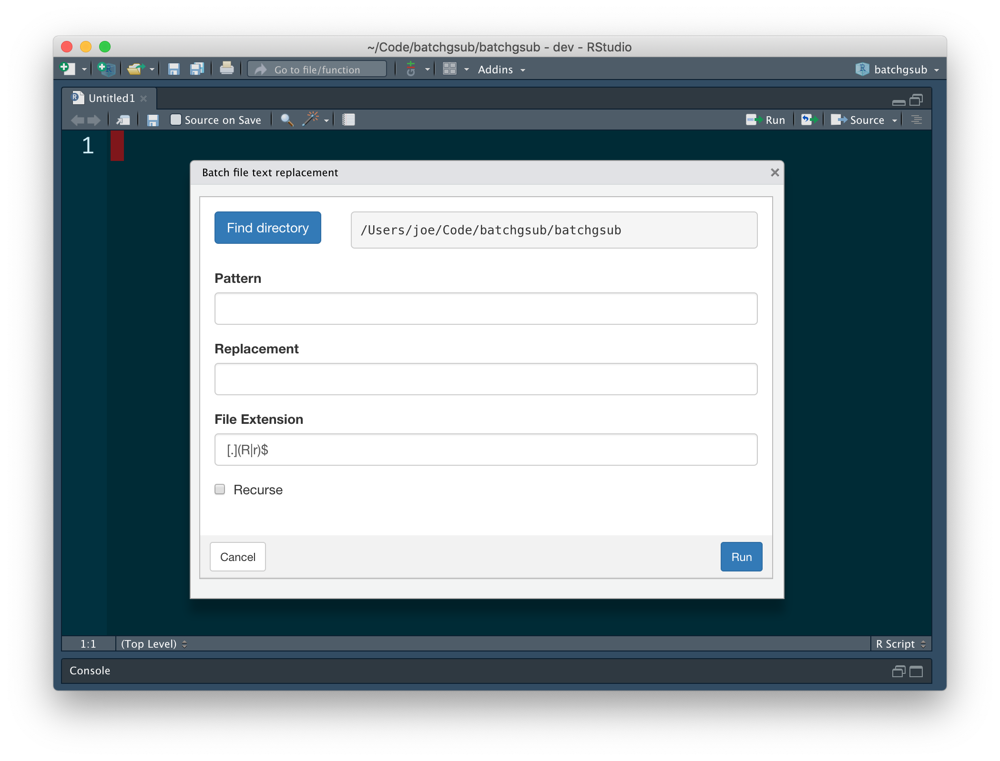
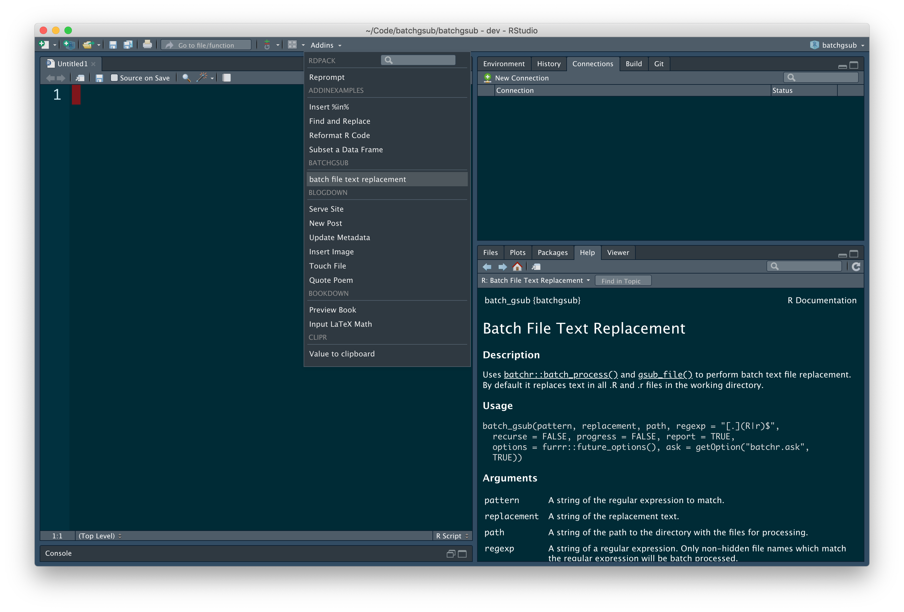

<!-- README.md is generated from README.Rmd. Please edit that file -->

```{r, include = FALSE}
knitr::opts_chunk$set(
  collapse = TRUE,
  comment = "#>",
  fig.path = "man/figures/README-",
  out.width = "100%"
)
```

# batchgsub

<!-- badges: start -->
[](https://www.tidyverse.org/lifecycle/#experimental)
[](https://travis-ci.com/poissonconsulting/batchgsub)
[](https://ci.appveyor.com/project/poissonconsulting/batchgsub)
[](https://opensource.org/licenses/MIT)
<!-- [](https://cran.r-project.org/package=batchgsub) -->
<!--  -->
<!-- badges: end -->

`batchgsub` provides a function, Shiny app and RStudio addin for batch replacement of text content in files.

## Installation

<!-- To install the latest release from [CRAN](https://cran.r-project.org) -->
```{r, eval=FALSE, echo=FALSE}
install.packages("batchgsub")
```

To install the developmental version from [GitHub](https://github.com/poissonconsulting/batchgsub)
```{r, eval=FALSE}
# install.packages("remotes")
remotes::install_github("poissonconsulting/batchgsub")
```

To install the latest developmental release from the Poisson drat [repository](https://github.com/poissonconsulting/drat)
```{r, eval=FALSE}
# install.packages("drat")
drat::addRepo("poissonconsulting")
install.packages("batchgsub")
```

## Demonstration

### Function
```{r}
library(batchgsub)

path <- tempdir()
file <- file.path(path, "file1.txt")
writeLines("The quick brown fox jumps over the lazy dog", con = file)
readLines(file)
batch_gsub("o", "ooo", path = path, regexp = "[.]txt$", ask = FALSE)
readLines(file)
```

### Shiny App
```{r, eval=FALSE}
batchgsub::run_app()
```



### RStudio addin

The RStudio addin opens the Shiny app from the [Addins menu](https://rstudio.github.io/rstudioaddins/).

The RStudio addin allows the user to set a keyboard shortcut to run the Shiny app.




## Contribution

Please report any [issues](https://github.com/poissonconsulting/batchgsub/issues).

[Pull requests](https://github.com/poissonconsulting/batchgsub/pulls) are always welcome.

Please note that this project is released with a [Contributor Code of Conduct](https://github.com/poissonconsulting/batchgsub/blob/master/CODE_OF_CONDUCT.md).
By contributing, you agree to abide by its terms.
