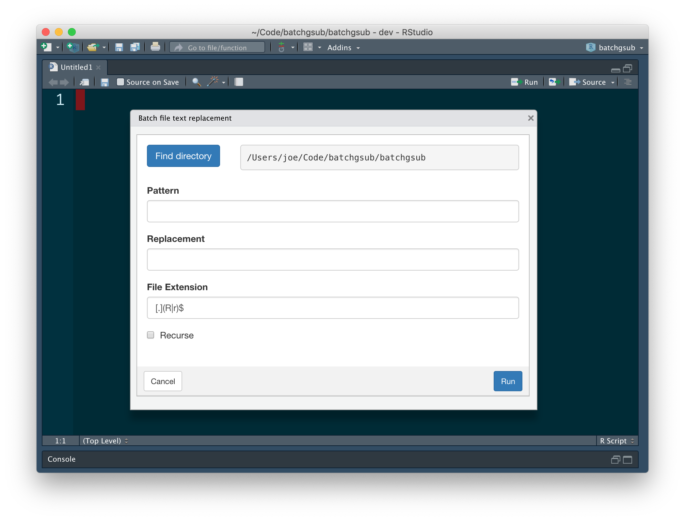
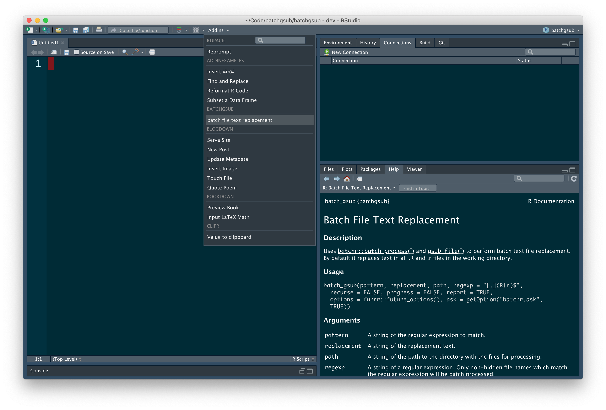

<!-- README.md is generated from README.Rmd. Please edit that file -->

# batchgsub

<!-- badges: start -->

[](https://lifecycle.r-lib.org/articles/stages.html#deprecated)
[](https://opensource.org/licenses/MIT)
<!-- [](https://cran.r-project.org/package=batchgsub) -->
<!--  -->
<!-- badges: end -->

`batchgsub` provides a function, Shiny app and RStudio addin for batch
replacement of text content in files.

## Installation

<!-- To install the latest release from [CRAN](https://cran.r-project.org) -->

To install the developmental version from
[GitHub](https://github.com/poissonconsulting/batchgsub)

``` r
# install.packages("remotes")
remotes::install_github("poissonconsulting/batchgsub")
```

## Demonstration

### Function

``` r
library(batchgsub)

path <- tempdir()
file <- file.path(path, "file1.txt")
writeLines("The quick brown fox jumps over the lazy dog", con = file)
readLines(file)
#> [1] "The quick brown fox jumps over the lazy dog"
batch_gsub("o", "ooo", path = path, regexp = "[.]txt$", ask = FALSE)
#> Warning: `future_options()` is deprecated as of furrr 0.2.0.
#> Please use `furrr_options()` instead.
#> This warning is displayed once every 8 hours.
#> Call `lifecycle::last_warnings()` to see where this warning was generated.
#> ✓ file1.txt [00:00:00.000]
#> Success: 1
#> Failure: 0
#> Remaining: 0
#> 
readLines(file)
#> [1] "The quick brooown fooox jumps ooover the lazy dooog"
```

### Shiny App

``` r
batchgsub::run_app()
```



### RStudio addin

The RStudio addin opens the Shiny app from the [Addins
menu](https://rstudio.github.io/rstudioaddins/).

The RStudio addin allows the user to set a keyboard shortcut to run the
Shiny app.



## Contribution

Please report any
[issues](https://github.com/poissonconsulting/batchgsub/issues).

[Pull requests](https://github.com/poissonconsulting/batchgsub/pulls)
are always welcome.

## Code of Conduct

Please note that the batchgsub project is released with a [Contributor
Code of
Conduct](https://contributor-covenant.org/version/2/0/CODE_OF_CONDUCT.html).
By contributing to this project, you agree to abide by its terms.
